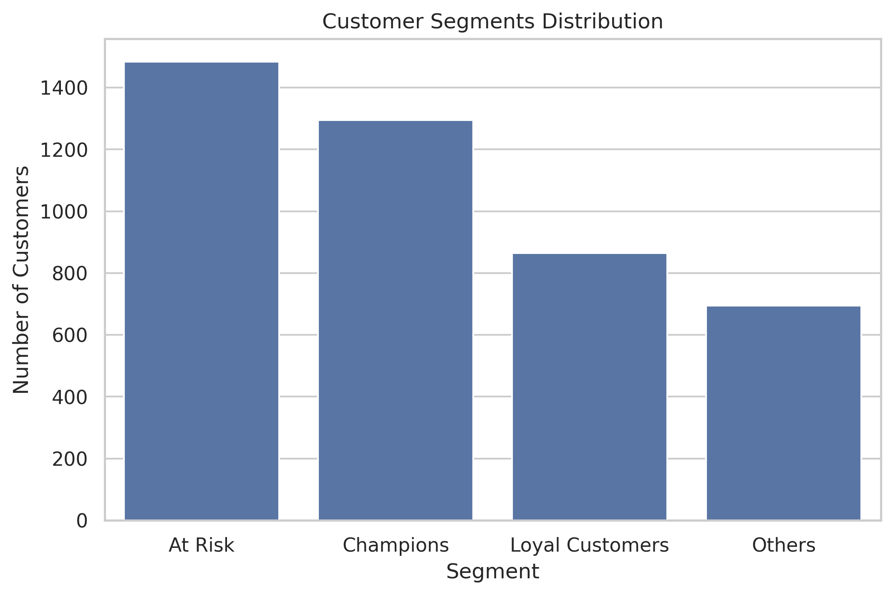
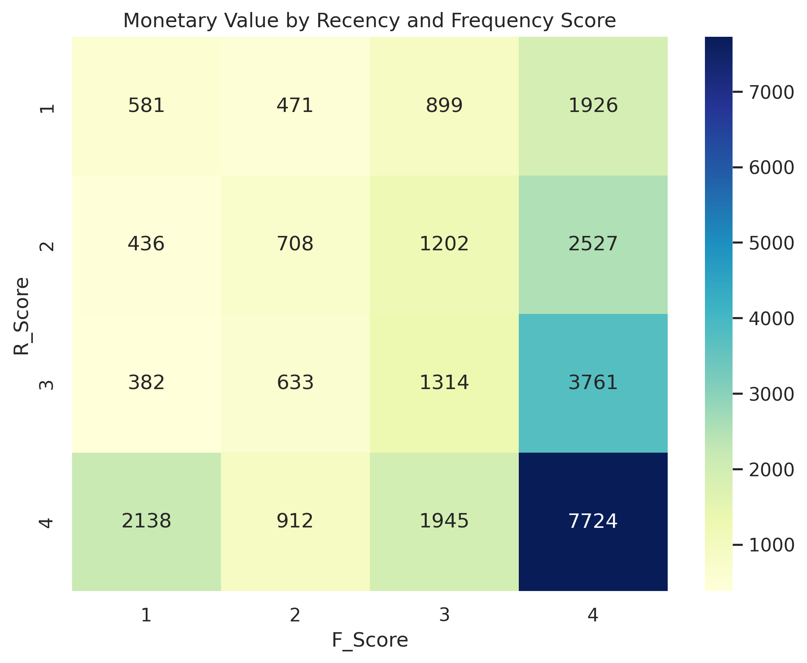

# Task 3: Customer Segmentation Using RFM Analysis

This project is part of my **Elevvo Internship (Data Analytics Track)**.  
The objective was to perform **customer segmentation** on the Online Retail dataset using **RFM (Recency, Frequency, Monetary)** analysis to identify key customer groups and suggest actionable marketing strategies.  

## 📂 Dataset
- Source: [Online Retail Dataset (UCI)](https://archive.ics.uci.edu/dataset/352/online+retail)  
- Data includes invoice details, customer IDs, quantities, unit prices, and purchase dates.

## 🛠️ Tools & Libraries
- Python
- Pandas
- Matplotlib
- Seaborn
- Jupyter Notebook

## 🔎 Key Steps
1. **Data Loading** – Import the Excel dataset into a Pandas DataFrame  
2. **Data Cleaning** – Remove missing CustomerIDs, filter negative/zero quantities or prices, convert data types for memory efficiency  
3. **Calculating RFM Metrics** – Compute Recency, Frequency, and Monetary value per customer  
4. **Assigning RFM Scores** – Score each metric from 1–4 based on quartiles  
5. **Segmentation** – Classify customers into segments like Champions, Loyal Customers, At Risk, and Others  
6. **Data Visualization** – Create bar charts and heatmaps to analyze RFM patterns  
7. **Insights & Marketing Suggestions** – Provide actionable recommendations for each segment  

## 📊 Key Insights
- **Champions:** High recency, frequency, and monetary — top customers to reward  
- **Loyal Customers:** Frequent buyers — encourage repeat purchases and cross-selling  
- **At Risk:** Inactive or infrequent buyers — target with re-engagement campaigns  
- **Others:** Moderate or new customers — monitor and engage lightly  

## 📈 Visualizations

### Customer Segment Distribution

### Monetary Value by Recency & Frequency

## ▶️ How to Run
- Install dependencies: `pip install -r requirements.txt`  
- Open the notebook: `jupyter notebook Customer_Segmentation_RFM.ipynb`  
